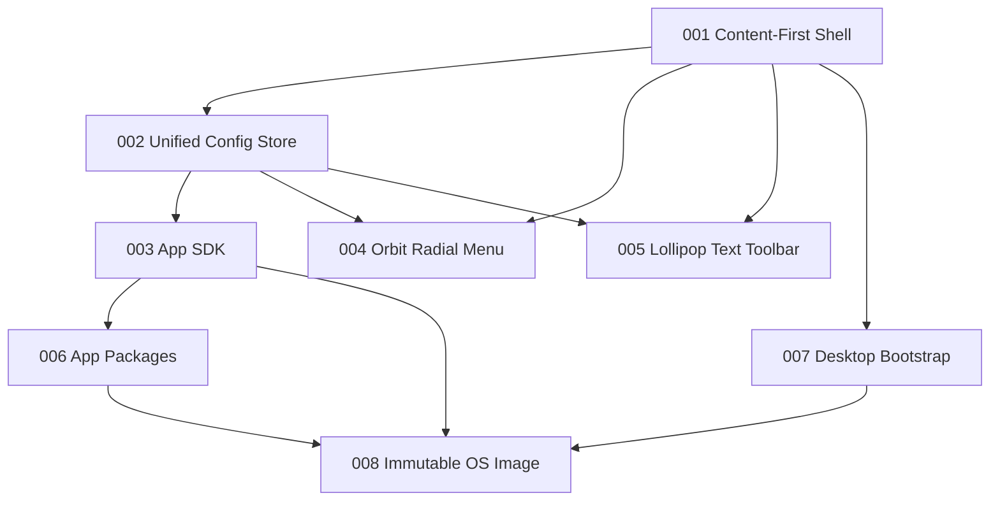

> RFC 000. Status: Draft. Target: sideswipe `master`, Zig 0.16.0. This file is an index, not a requirements document. Each numbered plan below is a self-contained RFC.

## Locked product decisions

- Sideswipe stays a Zig compositor. First-party apps use a Zig declarative SDK only. Foreign Wayland clients still run unmodified. The SDK is never ported to other compositors.
- Desktop first: a GUI bootstrap installer turns an existing Linux box into Sideswipe. An immutable ISO (NixOS or Arch) comes after the shell and SDK exist.
- RFC 001 process model stays: compositor owns gestures, layout, focus, and hits; one privileged shell client on `sideswipe_shell_v1`; fallback ring if the shell dies.

## Sequence

| RFC | Plan | Depends on | Amends 001 |
|---|---|---|---|
| 001 | [001-content-first-design.plan.md](001-content-first-design.plan.md) | — | — |
| 002 | [002-unified-config-store.plan.md](002-unified-config-store.plan.md) | 001 C1 sketch | C1 |
| 003 | [003-app-sdk.plan.md](003-app-sdk.plan.md) | 002 schema | — |
| 004 | [004-orbit-radial-menu.plan.md](004-orbit-radial-menu.plan.md) | 001 M3, 002 | S1, S2 |
| 005 | [005-lollipop-text-toolbar.plan.md](005-lollipop-text-toolbar.plan.md) | 001 M3, 002 | S6 |
| 006 | [006-app-packages.plan.md](006-app-packages.plan.md) | 003 MVP | — |
| 007 | [007-desktop-bootstrap.plan.md](007-desktop-bootstrap.plan.md) | 001 M3 prebuilts | — |
| 008 | [008-immutable-os-image.plan.md](008-immutable-os-image.plan.md) | 003, 006, 007 | — |

004 and 005 may run in parallel after 002. 007 may start as soon as prebuilt compositor artifacts exist. Do not start 008 until the desktop path works.

## What this file does not specify

Requirement IDs, protocols, file checklists, and acceptance live in the child RFCs. Do not add product scope here.
