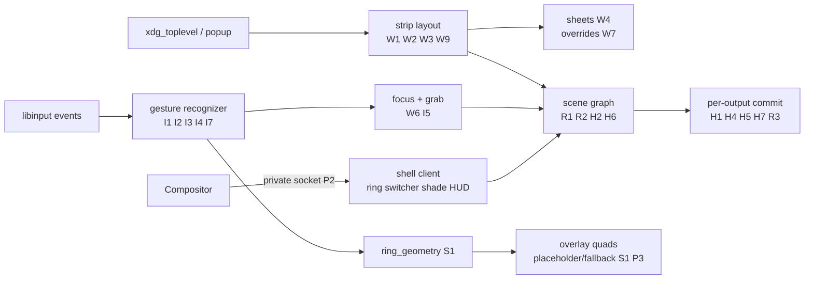

> Source: `docs/rfcs/001-content-first-design.md` (Status: Draft rev 3, Target: sideswipe `master`, Zig 0.16.0). This plan is the executable rendering of that RFC; requirement IDs (W/I/S/R/H/P/C/A) are stable and trace back to it.

## Requirements Summary

Sideswipe is a Wayland compositor with no persistent bar, dock, or panel. All shell UI is transient and summoned at the pointer. Windows never overlap: per-output, per-workspace horizontal strip of columns, each column a vertical stack of tiles. One pointer button plus motion reaches every navigation/command action via a radial menu, mobile-style gestures, switcher, shade, edit menu, and tile HUD. Same vocabulary maps across mouse (button chords), trackpad (multi-finger), and touchscreen (edge/hold) through one gesture abstraction.

### Goals

- No compositor-drawn pixel persists while idle; every shell element appears on demand and disappears on release or timeout.
- No two toplevels overlap; layout is a per-output, per-workspace horizontal strip of columns of tiles.
- Every action reachable with one pointer button plus motion; keyboard never required for launch/switch/window management.
- Same gesture vocabulary on mouse, trackpad, and touchscreen via one input abstraction.
- Existing Wayland clients (GTK4, Qt6, Chromium, Electron, SDL, winit) run unmodified.
- Pointer-button-down to first radial-menu frame under one refresh, measured via `wp_presentation` on the overlay in nested mode.
- Crisp HiDPI text via fractional-scale negotiation, no blurry downscale-upscale round trips.
- HDR never silently clipped: passthrough where panel and client support it, SDR never regresses when HDR is present.
- Small fixed accessibility accelerator set exists but is never required for pointer flows.

### Non-goals

- X11 support; Xwayland out of scope for initial milestones.
- Free-floating window mode, even optional; per-app override assigns full column, not floating layer.
- Config-file keybind systems (Hyprland/sway style); fixed I8 accelerators only, window rules and ring contents configurable.
- General shell plugin system in v1; one privileged client with fixed protocol.

### Window model (W)

- **W1** Per-output ordered workspaces; per-workspace ordered columns; per-column ordered tiles; one `xdg_toplevel` per tile. Workspaces per-output; cross-output move only via explicit drag-to-edge past 250 ms dwell. IPC exposes globally indexed `(output, workspace)`.
- **W2** Columns left-to-right at configured widths on infinite strip; viewport scrolls to keep focused column visible. Tiles split column height evenly unless committed `min_size` forces otherwise. Output resize/scale re-runs layout, one `configure` per affected toplevel with final size.
- **W3** New unparented `xdg_toplevel` becomes new column right of focused column and takes focus. Same-tick bursts insert right-to-left in map order (first-mapped ends leftmost). Fullscreen/maximized/minimized map per W8, never floating.
- **W4** New parented `xdg_toplevel` (`set_parent`, `xdg_dialog_v1`, or W7) becomes a sheet inside parent tile, bottom-anchored; parent content shrinks via `configure`. Sheet never leaves parent tile; tall content clips, client scrolls internally. Modal sheets block input to parent tile only. Sheets stack bottom-up in map order; closing parent closes sheets.
- **W5** `xdg_popup` renders above parent at positioner location, constrained via full `constraint_adjustment` (slide, flip, resize); only client surfaces allowed to overlap a toplevel. `popup_done` on any press outside popup tree. Opening any shell overlay dismisses all popups first; shell layer sits above popups while open.
- **W6** One focus stack per seat, global across workspaces/outputs. **Back** pops stack, refocusing previous tile (switching workspace/output, scrolling viewport). Closing removes all entries. Pointer enter sets hover only; click/gesture/`xdg_activation` sets keyboard focus.
- **W7** Per-app override table keyed on `app_id` (+ optional `title_substring` fallback): column width, dialog sheet-vs-column, server-side decorations. Lives in `~/.config/sideswipe/config.toml` under `[window_rules]`.
- **W8** `set_maximized` fills current column; unset restores strip geometry. `set_fullscreen` is transient output-covering overlay; back/second unset exits. `set_minimized` acknowledged but ignored (configure without minimized). `set_window_geometry` honored for sheets/popups. Client `move`/`resize`/`show_window_menu` get no grab, no error, no action.
- **W9** Layout inputs `(workspaces, viewport logical px, output scale, column fractions, per-tile min sizes)`; outputs integer logical geometries + per-tile configure serials. Re-layout idempotent, side-effect free.

### Input model (I)

- **I1** Device-independent primitives: `hold`, `flick(direction)`, `drag(direction, progress)`, `release`, `back`, `forward`, `zoom(delta)`. `zoom` continuous, quantized to width steps. Per-device translators receive finger counts/edge sources where available.
- **I2** Mouse: configurable shell button (default `BTN_SIDE`, fallback `BTN_EXTRA`, never `BTN_MIDDLE`). Hold = press + 400 ms within 6 px dead zone. Flick = press, move past dead zone, release within 300 ms. Sustained motion = drag with progress. Press deferred until disambiguation, else replayed with original timestamp. `BTN_BACK`/`BTN_FORWARD` only when no shell gesture in progress. `Ctrl+wheel` zooms only while shell button held or over tile gap, else passthrough.
- **I3** Trackpad: 3-finger swipe = drag/flick; 3-finger tap-and-hold (second tap held 300 ms) = hold; pinch = zoom; 2-finger horizontal swipe = drag(left|right) for column switch (no edge requirement).
- **I4** Touch: bottom-edge (outer 24 logical px) swipe = drag/flick up/sideways; top-edge swipe = drag down; long-press (500 ms, 10 px slop) = hold; left-edge swipe = back; pinch = zoom. Edge swipes claimed, touch sequence not delivered once threshold crossed. Non-edge long-press also delivered unless overlay opens, then `touch_cancel`.
- **I5** Shell-button events consumed per I2 before client delivery. All else passthrough unless overlay open (compositor grab). While overlay open, `pointer_constraints` locks suspended and `relative_pointer` paused; resumed on close.
- **I6** Gesture translation on Wayland event loop (single-threaded M0-M2), never blocks on rendering/client round-trips. No input thread until profiling proves need; if added, lock-free single-producer queue, never touches `wl_resource`.
- **I7** Direction lock: first 12 px decides axis by 30-degree cardinal cones. `drag(up|down)` switcher/shade; `drag(left|right)` column switch. Axis locked until release.
- **I8** Fixed accelerators (non-configurable v1): `Super+Left/Right` prev/next column, `Super+Up` switcher, `Super+Down` shade, `Super+Space` ring, `Escape` back/close. Mirrors gestures, accessibility only.

### Shell surfaces (S)

- **S1** Radial menu centered on pointer on `hold`. Up to 8 top-level slices; slice is action or sub-ring; sub-rings open on hover/drag-past. Release over slice activates; over center/outside cancels. `flick` activates matching slice without drawing. Hit-testing in compositor (`ring_geometry`); shell purely presentational, renders `ring_hover` highlight. Placeholder ring (solid quads) on first frame after hold; shell replaces with rich content when ready.
- **S2** Top-level ring user-configured and stable. Context-sensitive window actions live in exactly one designated sub-ring. Context frozen at `ring_open`.
- **S3** Switcher on `drag(up)`: horizontal card strip of every column in workspace, virtualized past 12 cards, adjacent workspaces via 150 px overscroll drag. Thumbnails are internal render-to-texture DMA-BUFs as `wl_buffer`s over shell protocol; no `ext_image_copy_capture` on this path.
- **S4** Shade on `drag(down)`: notifications + status HUD (clock, battery). Closes on release below 40% progress or tap outside. M5 bridges to existing notification daemon over D-Bus; network/audio/IME rows deferred. Clock + battery (`UPower`) only built-ins in v1.
- **S5** Adjacent-column switch on `drag(left|right)` / `flick(left|right)` per I7, viewport follows drag progress.
- **S6** Edit menu (iOS-style bar) on `zwp_primary_selection_v1` change (never `wl_data_device`). Placement: `zwp_text_input_v3` cursor rect, else pointer at selection time, else focused tile center. v1: copy, paste, search; app actions deferred.
- **S7** Tile HUD: title + app icon for 800 ms on pointer enter, 200 ms fade, never persists. Icons via `app_id` to `.desktop` lookup with generic fallback.
- **S8** Max lifetimes: ring until release; switcher/shade until release + 5 s clamp; edit menu 10 s; HUD 1 s. Surfaces living longer than seconds drift 1 device px on 60 s cycle. Drift is render offset only, never hit-testing. Drift + wallpaper dimming only when output `is_oled`.

### Rendering and panel care (R)

- **R1** Idle frame draws only client content + wallpaper. Damage tracking correct enough for zero-frame idle. One buffer commit per output per frame; per-surface passthrough removed when scene lands. `wl_surface.frame` fires only when output commits a frame containing the surface.
- **R2** Layer order bottom-to-top: wallpaper, toplevels+sheets, popups, shell overlays, cursor. Shell surfaces alpha-blended for fade without client redraws.
- **R3** Per-output `is_oled` flag; EDID/DisplayID autodetect best-effort only, config override is source of truth. When set, S8 drift enabled and wallpaper dimmed after `ext_idle_notifier_v1` interval.

### HiDPI and HDR/color (H)

- **H1** Per-output preferred fractional scale from mode + physical size (EDID/DisplayID) unless config override. Clients get `wp_fractional_scale_v1` + `wp_viewporter`; legacy `wl_output.scale` sends `ceil(fractional)`. Integer `set_buffer_scale` keeps working, composes with fractional.
- **H2** Layout in logical px; scene composites in physical px per output. Buffer sampled at visible outputs' scale; spanning surface re-renders from highest-scale buffer, never upscaled low-scale copy.
- **H3** Shell overlays, fallback ring, cursor scale-aware: logical geometry rasterized at physical resolution. Cursor via `wp_cursor_shape_manager_v1` per-output scale.
- **H4** Per-connector `[output]` holds `scale` override + `hdr` (`auto`/`on`/`off`, default `auto`). Missing entries fall back to auto-detect, never hardcoded 1.0 except nested-test outputs.
- **H5** Per-output HDR caps from parsed CTA-861 HDR static-metadata + colorimetry (EOTFs, max/avg/min luminance, BT.2020) + DisplayID HDR blocks where present. Exposed as `wp_color_manager_v1` output descriptions; no HDR blocks means SDR-only.
- **H6** Implement `wp_color_management_v1` + `wp_color_representation_v1`. Client attaches HDR description to opt in. Fullscreen HDR takes direct passthrough (scanout or single-quad), commits `HDR_OUTPUT_METADATA` + `Colorspace`. Mixed strip composites in SDR container v1 (fixed Reinhard down-map, SDR whites never clipped); full HDR scene composition is v2 follow-up.
- **H7** SDR sRGB is default output description. HDR engages only when client requested HDR + output caps allow + `[output] hdr` not `off` (`auto` = fullscreen passthrough only; `on` = HDR container for whole output).
- **H8** Renderer advertises 10-bit (`XRGB2101010`, `XBGR2101010`, `ARGB2101010`) + 16-bit float (`ABGR16161616F`) DMA-BUFs alongside 8-bit, imports via EGL, never clamps HDR in passthrough. SDR blending in linear light; no fake-HDR upconversion.

### Process model (P), config (C), accessibility (A)

- **P1** Gesture recognition, layout, focus, input grab live in compositor process.
- **P2** Shell UI is single privileged client on private socket (`$XDG_RUNTIME_DIR/sideswipe-shell-$PID`, mode 0700), path via `SIDESWIPE_SHELL_SOCKET`, authenticated by `wl_client_get_credentials` pid equality before `sideswipe_shell_v1` bind. Never on public `WAYLAND_DISPLAY`.
- **P3** Shell death restarts shell; compositor stays usable via minimal in-compositor fallback ring (switch, close, launch terminal) through same overlay quad path as S1 placeholder.
- **P4** External tooling uses versioned IPC (`sideswipe_compositor@v1`), not shell protocol; breaking changes bump version.
- **C1** One TOML file `$XDG_CONFIG_HOME/sideswipe/config.toml`: `[shell]`, `[ring]`, `[window_rules]`, `[output]` (`is_oled`, idle dim, `scale`, `hdr`). Missing file = compiled defaults; invalid entries log + fall back per-key, never abort.
- **A1** v1 floor: I8 accelerators, shell `activate(slice_id)` path, focus-visible highlight on fallback ring. Screen-reader/high-contrast deferred.

## Approach

Strategy: land input dispatch and scene-graph foundations first, then strip layout + HiDPI, then gestures + fallback ring, then privileged shell client, then sheets/animation, then shade/menus/HUD, then DRM/HDR/lock. Keep existing clients unmodified; validate each milestone against the compatibility matrix at 1.0/1.5/2.0 scales (HDR row from M6).



### Layout engine

Pure function `(workspace state, viewport, scale, column fractions, min sizes)` to geometries + configure serials in `src/compositor/layout/`, no Wayland deps, unit-tested with fabricated windows. Animation is separate interpolation layer feeding target geometries into per-tile springs; one `configure` per animation with final size; scale last committed buffer with linear filtering during transition; early-swap if client commits final-size buffer early. Column widths `{1/4, 1/3, 1/2, 2/3, 1}` (1/4 for ultrawide), `zoom`-adjustable while hovered, 120 zoom units per step.

### Sheet semantics

Target height = min(desired, 60% parent tile). Desired resolves: `window_geometry` height from first commit, else `min_size` clamped by `max_size`, else half parent height. Sheet configure width = parent tile width; parent gets shrunken-height configure in same pass. Sheets get `xdg_toplevel_decoration_v1.configure(server_side)` + top-edge grab handle (additive, GTK CSD keeps headerbars). No-parent dialogs become columns per W3; only `xdg_dialog_v1` + W7 reclassify; no size heuristics.

### Radial menu geometry

Compositor sends on `hold`: pointer in output-logical coords, output geometry/scale, top-level slices, frozen context sub-ring. Shared `src/compositor/ring_geometry.zig` compiled into compositor and shell; angular hit-testing with dead-zone radius; compositor emits `ring_hover(slice_id)`. Defaults: 6 px dead zone, 300 ms max press, 12 px axis lock; optional first-run calibration writes `[shell]`, skippable.

### HiDPI and HDR pipeline

HiDPI: logical layout (W9) times fractional scale (H1) to physical quads. `wp_viewporter` lets one high-res buffer serve per-output crop/sample; never upscale low-scale buffer for high-scale output. Shell overlays commit at physical resolution with `wp_viewport` src/dst. Preferred scale: 1.0 below ~140 DPI, 1.5 to ~200 DPI, 2.0 above, always per-connector overridable (H4).

HDR: `core.display` CTA caps published as output descriptions (H5). Client HDR surfaces carry descriptions (ST2084/HLG, BT.2020, static metadata type 1). Fullscreen HDR bypasses blending (single quad or direct scanout), atomic commit writes `HDR_OUTPUT_METADATA` + `Colorspace` from surface description. Windowed/mixed stays SDR container with fixed Reinhard down-map (H6). Last HDR unmap restores SDR description + clears metadata in same atomic commit. Shell always SDR sRGB.

### Protocols required

Server-side additions beyond today (`wl_compositor` v6, `wl_shm`; `wl_subcompositor` still missing and required):

| Protocol | Purpose | Requirement |
|---|---|---|
| `wl_subcompositor` | Subsurfaces for video, tooltips-in-client | baseline (GTK/Qt/Chromium need it) |
| `xdg_shell` (complete: popups, positioner, parent, states, window geometry) | Baseline | W3-W5, W8 |
| `xdg_dialog_v1` | Modal/dialog identification | W4 |
| `xdg_decoration_unstable_v1` | Force server-side decorations for sheets | W4 |
| `xdg_output_manager_v1` | Logical output description for clients | W1 |
| `wlr_layer_shell_v1` | Wallpaper only | R1 |
| `ext_session_lock_v1` | Lock screen (only lock path) | M6 |
| `ext_idle_notifier_v1` | Idle detection for dim (R3) | R3 |
| `zwp_pointer_gestures_v1`, `zwp_pointer_constraints_v1`, `zwp_relative_pointer_v1` | Pass-through; games; suspended during shell grabs per I5 | I5 |
| `wl_touch`, `zwp_tablet_v2` (tool + pad) | Touch and stylus input | I4 |
| `zwp_primary_selection_v1`, `zwp_text_input_v3` | Edit menu triggering and placement | S6 |
| `wp_viewporter`, `wp_fractional_scale_v1`, `wp_presentation` | Buffer cropping, HiDPI scale, frame timing feedback | H1-H2, layout, S1 latency |
| `wp_color_management_v1`, `wp_color_representation_v1` | Output/surface descriptions, YUV info | H5-H7 |
| `wp_tearing_control_v1` | Tearing only on fullscreen HDR passthrough | H6 |
| `wp_cursor_shape_manager_v1` | Server-side cursor shapes, per-output scale | H3 |
| `xdg_activation_v1` | Focus requests from launchers | W6 |
| `ext_foreign_toplevel_list_v1` | Window enumeration for shell and IPC | S3, P4 |
| `sideswipe_shell_v1` (private, private socket only) | Shell client protocol | P2 |

Deferred past v1: `ext_image_copy_capture_v1` (external OBS-style capture; shell uses internal thumbnails), `zwp_input_method_v2` (IME + status row). Not deferred: fractional-scale HiDPI (M1/M3) and HDR passthrough (M6); only full HDR scene composition is v2 (M7).

### `sideswipe_shell_v1` sketch

Coords are output-logical px; `output` is `wl_output` global id. `scale` in `ring_open`/`toplevel_thumbnail` is current fractional scale (H1); shell rasterizes at `logical * scale`. Shell surfaces always SDR sRGB, never carry HDR descriptions.

Events compositor to shell:

- `ring_open/serial, x, y, output, scale, slices` / `ring_hover/serial, slice_id` / `ring_close/serial)` where `slices` = `(id:u32, label:string, icon:string, has_subring:bool)[]`.
- `switcher_open/serial, columns` / `switcher_progress/serial, progress` / `switcher_close/serial, selected_column)` where `columns` = `(handle:u32, title:string, app_id:string)[]`.
- `shade_open/serial)` / `shade_progress/serial, progress` / `shade_close/serial)`.
- `edit_menu_open/serial, x, y, mime_types)` / `edit_menu_close/serial)`.
- `tile_enter/handle, title, app_id)` / `tile_leave/handle`.
- `toplevel_thumbnail/handle, wl_buffer, width, height, scale)` reusing `linux_dmabuf`; shell destroys `wl_buffer` to release. Handles are private uints from `tile_enter`, invalidated by `tile_leave`; unknown handles are protocol error.
- `toplevel_closed/handle)` for entries vanishing while switcher open.

Requests shell to compositor:

- `set_ring/slices` at startup and on user edit; persisted by compositor to `[ring]`.
- `activate/serial, slice_id` for pointerless activation (accessibility); serial must match last `ring_open`.
- `commit_surface/serial, role, wl_surface` (`role` in `{ring, switcher, shade, edit_menu, hud}`). No matching open serial is protocol error; surfaces double-buffered, mapped only while open live.

## Task List

| # | Task | Phase | Milestone | Parallel | Status |
|---|---|---|---|---|---|
| 1 | M0 Input dispatch: real `wl_seat` + focus, pointer/keyboard delivery, `wl_subcompositor`, xkbcommon keymap, nested only | foundation | M0 | A1 | pending |
| 2 | M1 Strip layout + complete popups + fractional-scale HiDPI: columns, logical/physical split, `ceil` scale, DRM smoke + HDR caps log | layout+hidpi | M1 | A2 | pending |
| 3 | M2 Gesture recognizer + mouse translator + fallback ring: axis lock, press replay, adjacent-column switch, back | input | M2 | A3 | pending |
| 4 | M3 Shell client ring + switcher over private socket: presentational shell, internal thumbnails, placeholder latency path | shell | M3 | A4 | pending |
| 5 | M4 Sheets + dialog + overrides + animation: height resolution, decorations, early-swap, 10-bit/float import | windows | M4 | A5 | pending |
| 6 | M5 Shade + edit menu + HUD + OLED/idle: D-Bus bridge, UPower clock/battery, primary-selection trigger | shell-ui | M5 | A6 | pending |
| 7 | M6 Trackpad/touch + DRM atomic + HDR passthrough + lock + accelerators: metadata commit/clear, A1 floor | hardware+hdr | M6 | A7 | pending |
| 8 | M7 (v2, tracked) Full HDR scene composition: operator + container choice, keep SDR down-map passing | hdr-v2 | M7 | A8 | pending |

### M0 acceptance

Real `wl_seat` with pointer/keyboard/touch objects, enter/leave/motion/button/axis/frame delivery, keyboard focus + keymap via xkbcommon. Focus stack per seat (W6) with `xdg_activation`. Shell-button grab skeleton (I5) with constraint suspension. `wl_subcompositor` baseline. Nested mode only.

### M1 acceptance

Workspace/column/tile model + layout fn (W1-W3, W9). `xdg_positioner` all fields + `xdg_popup` grab/`popup_done` (W5). `wp_fractional_scale_v1` + `wp_viewporter`, logical layout/physical render (H1-H2, H4 scale). Scene replaces per-surface commit loop with per-output composite-then-commit; idle elision (R1). Matrix green for map + resize at 1.0/1.5/2.0. DRM smoke (one output, no atomic), HDR caps logged (H5).

### M2 acceptance

`gesture.zig` recognizer (I1) + mouse translator defaults (I2), axis lock (I7), press replay (I2). `Capabilities` bitset replaces `DeviceType` enum; gesture/touch/tablet/switch events plumbed with libinput timestamps. Scale-aware fallback ring (S1, P3, H3) via solid/rounded-rect quads. Adjacent-column switch + back (S5, W6).

### M3 acceptance

`sideswipe_shell_v1` on private socket with pid-equality auth (P2). Shell binary (Zig, `wl_surface` + DMA-BUF, `wl_shm` fallback) renders ring + switcher from `ring_geometry` (S1-S3), physical-pixel raster (H3). Render-to-texture thumbnails as DMA-BUF `wl_buffer`s (S3). Placeholder-ring latency under one refresh via `wp_presentation` in nested mode. `set_ring` persisted to `[ring]`.

### M4 acceptance

Sheet placement + height resolution order (W4), `xdg_dialog_v1`, `xdg_decoration_unstable_v1` server-side + grab handle, W7 override table from `config.toml` (C1). `set_maximized`/`set_fullscreen`/`set_minimized`/`set_window_geometry` per W8; `move`/`resize` no-op documented. Spring animation + scaled-buffer-during-resize with early-swap. Renderer 10-bit/float import (H8).

### M5 acceptance

Shade with D-Bus notification bridge (M5), clock + battery (`UPower`) HUD (S4). Edit menu on primary-selection change with text-input placement (S6). Tile HUD 800 ms + 200 ms fade with `.desktop` icons (S7). Lifetimes + 60 s 1 px drift + wallpaper dim after idle when `is_oled` (S8, R3, `ext_idle_notifier_v1`).

### M6 acceptance

Trackpad (I3) + touchscreen (I4) translators. Full DRM atomic session on real hardware; `wp_color_management_v1` + `wp_color_representation_v1` + `wp_tearing_control_v1` (passthrough path only); `HDR_OUTPUT_METADATA` + `Colorspace` commit/clear in same atomic commit (H5-H7); SDR default + `auto`/`on`/`off` policy; never clamp passthrough, linear-light SDR blend (H8). `ext_session_lock_v1` blanks + drops input. I8 accelerators + A1 floor. HDR matrix row green.

### M7 acceptance (v2, tracked)

Mixed SDR/HDR strip composition in chosen container with chosen operator. v1 Reinhard down-map keeps passing while in flight. Open question on operator/container resolved here, not dropped.

## File Checklist

| Order | File |
|---|---|
| 1 | `src/backend/input.zig`, `src/backend/libinput.zig` (gesture/touch/tablet/switch events, `Capabilities` bitset, timestamps) |
| 2 | `src/compositor/input/gesture.zig` (recognizer I1, translators I2-I4, axis lock I7, replay I2) |
| 3 | `src/compositor/input/seat.zig` (real `wl_seat`, grab I5, xkbcommon) + `focus.zig` (W6, activation) + `ring_geometry.zig` (S1) |
| 4 | `src/compositor/protocols/xdg_shell.zig` (`xdg_positioner`/popup W5, parent/geometry/states W3-W4/W8, no-op move/resize) |
| 5 | `src/compositor/protocols/` siblings (`wl_subcompositor`, `xdg_dialog_v1`, `xdg_decoration_unstable_v1`, `xdg_output_manager_v1`, `ext_idle_notifier_v1`, `xdg_activation_v1`, fractional/viewporter M1, color/tearing M6) |
| 6 | `src/compositor/layout/strip.zig` (W1-W3, W9) + `sheet.zig` (W4) + `overrides.zig` (W7, C1) + `anim.zig` (springs, early-swap) |
| 7 | `src/compositor/scene/` (5 layers, logical/physical quads H2, damage/pixman, alpha overlays R2, HDR passthrough H6, idle elision R1) |
| 8 | `src/backend/renderer.zig` (alpha/opacity, solid/rounded-rect quads S1/P3, render-to-texture S3, 10-bit/float + linear blend + no-clamp H6/H8, nested composite) |
| 9 | `src/compositor/output.zig`, `src/core/display/` (`is_oled` R3/C1, fractional scale H1/H4 + `ceil`, HDR caps H5, `HDR_OUTPUT_METADATA`/`Colorspace` commit/clear H6-H7, idle dim) |
| 10 | `src/shell/` binary (P2 private socket, ring/switcher/shade/menu/HUD, DMA-BUF + `wl_shm` fallback, physical-px H3, SDR-only) |
| 11 | `src/ipc/` (`sideswipe_compositor@v1`: `list_toplevels`, `focus`, `close`, `move_column`, `set_ring`, `subscribe`; 0600 socket, P4) |
| 12 | `build.zig` (protocol scanner via `pkg-config wayland-protocols`, vendored `protocols/xml/` fallback, server+client headers, xkbcommon/pixman, `shell` target, `run-nested`) |
| 13 | `protocols/xml/sideswipe-shell-v1.xml` + wlr/wayland-protocols stable+staging (fractional, viewporter, presentation, color-management, color-representation, tearing) |
| 14 | `~/.config/sideswipe/config.toml` (`[shell]`, `[ring]`, `[window_rules]`, `[output]` per C1/H4) |

## Compatibility Matrix (run per milestone from M1)

GTK4 (`gnome-text-editor`), Qt6 (`qtdemo`), Chromium, Electron (`vscode`), SDL (`testgles`), winit example. Each must map, resize through one animation, open one parented dialog as sheet, open one popup. Failures go to W7 table, never floating exceptions. From M1: also at 1.5 and 2.0 (crisp text, correct `ceil`, H1-H2). From M6: HDR row (mpv/Chromium HDR sample on HDR output: metadata on fullscreen, SDR restored after, H5-H7).

Development loop (nushell):

```nu
zig build
with-env { WAYLAND_DISPLAY: "wayland-0" } { ./zig-out/bin/sideswipe -v }
# in another terminal (nested display is printed by sideswipe on startup)
with-env { WAYLAND_DISPLAY: "wayland-1" } { foot }
```

Primary loop once M3 lands: `zig build run-nested` (compositor nested with shell attached).

## Security Considerations

- Shell protocol binds only on private socket after pid-equality auth (P2); never advertised publicly.
- IPC socket mode 0600; no network listener.
- Thumbnails + global pointer visible only to shell client, never ordinary clients.
- Session lock (`ext_session_lock_v1`) blanks outputs + drops client input until unlock; ships M6 before real-hardware daily use.
- HDR caps are per-output public info; per-surface HDR metadata visible only to owning client + compositor.

## Open Questions

- Modal-sheet parent dim: default dim 20%, configurable under `[window_rules]`; revisit after M4 dogfooding.
- Thumbnail transport: DMA-BUF `wl_buffer` with automatic `wl_shm` fallback; closed to "both, with fallback" unless iGPU measurement shows fallback never hit.
- M7 tone-mapping operator + mixed-scene container (SDR vs HDR); v1 ships fixed Reinhard down-map (H6), choice stays tracked.

## Notes

- Tree today: nested backend, GLES 3.0 + DMA-BUF import, `wl_compositor` v6 double-buffered + damage, basic `xdg_shell` (toplevel only, popup ignores parent/positioner, states prepared not driven), stub `wl_seat`/`wl_output`/`wl_data_device_manager`, no `wl_subcompositor`, libinput pointer/motion/axis/key only (gesture/touch/tablet/switch dropped, single `DeviceType` enum misclassifies multi-capability devices), display-info EDID/DisplayID/CTA with SIMD, custom IPC. No scene graph, focus, layout, input dispatch (per-surface commits), shell layer, or gestures.
- Current tree has no reliable OLED bit in EDID/DisplayID; config is source of truth (R3).
- Fractional scale must land before color; color must not land without fractional scale working.
- `BTN_MIDDLE` never reserved (primary-selection paste).
- Shell surfaces double-buffered, mapped only while open live; unknown thumbnail handles and commit-without-open are protocol errors.
- Execution: implement milestone by milestone (M0 to M6, M7 tracked); keep matrix green; measure S1 latency via `wp_presentation` in nested mode from M3.
