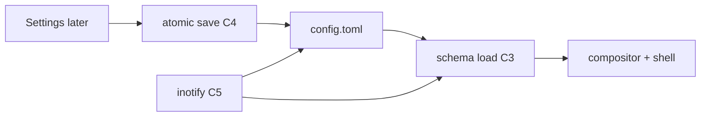

> RFC 002. Status: Draft. Target: sideswipe `master`, Zig 0.16.0. Depends on RFC 001 (C1 sketch). Amends C1. Unblocks 003, 004, 005. No Settings UI in this RFC (003).

## Requirements Summary

Configuration is one directory of TOML files. A typed Zig schema is canonical; TOML is the serialization. The compositor, privileged shell, and later Settings all read and write this store. The GUI never owns a parallel database.

### Goals

- Replace the scale-only parser in `src/compositor/output.zig` with a real store.
- Missing file means compiled defaults. Invalid keys log and fall back per-key. Startup never aborts on bad config.
- A write from any writer is visible to every reader after the next reload.
- Hand-edits appear in a future Settings GUI without a second store.

### Non-goals

- Settings UI, schema-generated pages (003).
- Comment-preserving rewrite (v2). Last writer wins; GUI writes canonical TOML.
- Hyprland-style keybind tables. One remappable summon chord may live under `[shell]` (004).
- Ring item payloads and toolbar extension tables beyond empty placeholder files (004, 005).

## Requirements (C)

- **C1** (amended) Config lives under `$XDG_CONFIG_HOME/sideswipe/`, not a single file with every concern jammed in. `config.toml` holds `[shell]`, `[window_rules]`, `[output]`, `[theme]`. `ring.toml` and `toolbar.toml` are reserved siblings.
- **C2** One Zig schema type is the source of truth. Field names match TOML keys. Defaults are in the schema, not scattered `if (null)` sites.
- **C3** Load: missing file → defaults. Unknown keys ignored + logged. Known keys with bad values fall back per-key + logged. Session continues.
- **C4** Save: write the schema to TOML atomically (temp file + rename). Readers must be able to load what save wrote.
- **C5** Watch the directory (inotify, or mtime poll where inotify is absent). External mtime changes reload. Writes originated by this process do not loop.
- **C6** `SIDESWIPE_SCALE` remains a debug override and wins over `[output]` until removed in a later cleanup. Nested-test outputs may still hardcode 1.0.
- **C7** Invalid or unreadable `ring.toml` / `toolbar.toml` must not block compositor start. 004 and 005 own those schemas.

## Approach

New module `src/core/config/` with no Wayland imports so compositor, shell, and SDK Settings can all link it. Public surface: `Config`, `load(path)`, `save(path, Config)`, `watch(path, on_change)`.

`[shell]` v1 keys: shell button, dead zone, hold/flick timeouts (001 I2). `[output.<name>]`: `scale`, `hdr`, `is_oled`, idle dim (001 H4, R3). `[window_rules]` is the W7 table. `[theme]`: `appearance = "system"|"light"|"dark"` only.

Replace `readScaleOverride()` in `src/compositor/output.zig` with `config.output(name).scale`.

## Acceptance

- Unit tests: missing file, unknown key, bad value, round-trip save/load, watch fires on external write, watch does not fire on own save.
- Nested compositor starts with no config dir, with a valid file, and with a broken file (logs + defaults).
- Changing `[output.<name>] scale` on disk updates the next output configure without restart.

## File Checklist

| Order | File |
|---|---|
| 1 | `src/core/config/schema.zig` |
| 2 | `src/core/config/toml.zig` (load/save) |
| 3 | `src/core/config/watch.zig` |
| 4 | `src/core/config.zig` (module root) |
| 5 | `src/compositor/output.zig` (drop ad-hoc scale parser) |
| 6 | `src/compositor/layout/overrides.zig` when M4 lands (W7 reads this store) |

## Security Considerations

- Paths stay under the user's XDG config dir. No network. No include-from-arbitrary-path in v1.
- World-readable config is acceptable (no secrets). Mode 0600 if we later store tokens.

## Open Questions

- TOML library: vendor a small parser vs hand-roll the v1 subset. Decide in implementation; schema tests must not depend on the choice.
- Whether `ring.toml` stays TOML or keeps Orbit's versioned JSON. 004 decides; 002 only reserves the path.

## Notes

- 001 C1 text still says one file. Treat this RFC as the amendment. Do not silently add a second store in 004/005.
- Comment preservation is explicitly deferred. macOS `defaults` does not preserve comments either.
