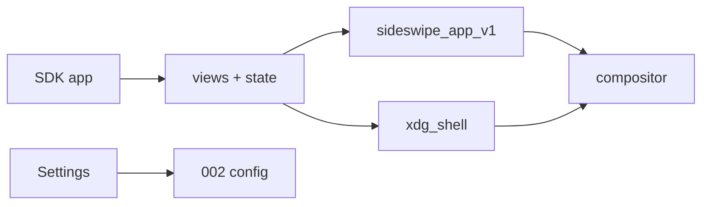

> RFC 003. Status: Draft. Target: sideswipe `master`, Zig 0.16.0. Depends on RFC 002 (schema) and RFC 001 (xdg-shell, W4 sheets). Unblocks 006 and 008. Settings UI lives here; ring/toolbar pages are filled by 004/005.

## Requirements Summary

First-party desktop apps are written in Zig against a SwiftUI-like toolkit we own. Zig has no result builders, so the API is comptime-friendly function composition plus retained state. The SDK talks Wayland + `sideswipe_app_v1`. The compositor does not import widgets.

```zig
pub fn Notes() sdk.View {
    const title = sdk.State([]const u8).init("Untitled");
    return sdk.navigationStack(.{
        sdk.vstack(.{
            sdk.textField(title.binding()),
            sdk.button("Done", .{ .role = .confirm }),
        }).padding(16),
    });
}

pub fn main() !void {
    try sdk.App.run(Notes);
}
```

### Goals

- Zero to a running window via `sideswipe new notes && sideswipe run`.
- Window and sheet roles map onto the 001 strip (column) and W4 sheet model.
- Settings is the first system app and writes the same store as 002.
- Foreign GTK/Qt/Chromium clients keep working; they simply do not use this SDK.

### Non-goals

- Supporting GNOME, KDE, Hyprland, or any other compositor.
- A new language or Swift runtime.
- Privileged shell protocol access (`sideswipe_shell_v1` stays P2-only).
- Package format (006) and ISO installer UI (008).
- Full control gallery in v1. MVP is stacks + text + button + textField + toggle + list + slider.

## Requirements (D)

- **D1** `sdk` is a module (`src/sdk/` or a pinned sibling). `App.run` creates a Wayland client, maps one toplevel, and runs the event loop.
- **D2** `State` / `Binding` / `Observed` invalidate the view tree. Rebuild is retained-mode: diff, do not throw away the window.
- **D3** `sideswipe_app_v1` (public socket): app id, window role `{column, sheet, inspector}`. Sheets use W4. Missing protocol → plain xdg-shell column so nested testing still works.
- **D4** Theme tokens: `appearance` from 002 `[theme]`, materials `{translucent, solid, none}`. Ricing is data, not a CSS fork.
- **D5** CLI: `new` writes a `build.zig` template; `run` builds and launches under the nested compositor; `preview` rebuilds on file change.
- **D6** Settings dogfood: generated or hand-bound pages for `[shell]`, `[output]`, `[theme]`. Save uses 002 `save`. File-watch reload updates widgets.
- **D7** The compositor never `@import("sdk")`. Shell may use the SDK later; v1 shell in 001/004 may still draw with raw `wl_surface`.

## Approach



MVP controls: `vstack`, `hstack`, `zstack`, `grid`, `spacer`, `scroll`, `text`, `textField`, `button`, `toggle`, `slider`, `list`, `image`. Navigation: `navigationStack` + sheet presentation.

The bootstrap installer (007) cannot use this SDK. The ISO installer (008) can.

Dogfood order after Settings: ring editor pages (004), toolbar pages (005), Notes or Files, Store (006).

## Acceptance

- `sideswipe new demo && sideswipe run` opens a window with a button that increments a `State` counter.
- Settings changes `[theme] appearance` on disk; compositor/shell pick it up via 002 watch.
- A parented SDK sheet follows W4 (bottom-anchored, parent shrinks) once 001 M4 exists. Until M4, sheet role may map to a column and the gap is documented.
- `zig build test` covers state invalidation and layout of a fixed vstack (no compositor required).

## File Checklist

| Order | File |
|---|---|
| 1 | `src/sdk/app.zig`, `src/sdk/view.zig`, `src/sdk/state.zig` |
| 2 | `src/sdk/layout.zig`, `src/sdk/controls.zig` |
| 3 | `src/sdk/theme.zig` |
| 4 | `protocols/xml/sideswipe-app-v1.xml` + compositor bind |
| 5 | `src/tools/sideswipe-cli/` (`new`, `run`, `preview`) |
| 6 | `src/apps/settings/` |

## Security Considerations

- `sideswipe_app_v1` is public but low privilege: identity + role hints. No global pointer, no selection steal, no ring control.
- Settings writes only the user's XDG config dir.

## Open Questions

- Renderer: SDK-owned GLES/shm vs compositor-side server widgets. Default: client-side SDK renderer (shm or DMA-BUF) so the compositor stays protocol-shaped.
- Whether the privileged shell switches to the SDK in the same milestone as Settings or stays raw until 004/005 polish.

## Notes

- Placeholder name "Sideswipe App SDK" is fine until a product name exists.
- Do not start 006 until D1–D5 work; Store is not the first dogfood app.
