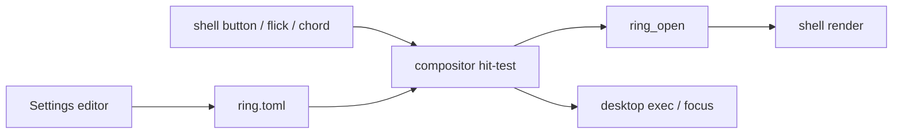

> RFC 004. Status: Draft. Target: sideswipe `master`, Zig 0.16.0. Depends on RFC 001 M3 (`sideswipe_shell_v1`, fallback ring) and RFC 002. Amends S1 and S2. Port source: `/home/jsalopek/dev/ventana/orbit/src/Orbit.Core`.

## Requirements Summary

The radial menu is the primary command surface. Orbit's muscle-memory ring (fixed slots, not MRU) replaces the 001 eight-slice sketch. The compositor still hit-tests and activates; the shell only presents. Summon stays compositor-owned (shell button, flick, I8 `Super+Space`) so we never need `WH_MOUSE_LL`.

### Goals

- Port Orbit.Core geometry, navigation, trigger policy, and ring schema.
- Launch apps/files/folders/URLs/actions from slots.
- Multi-ring + per-`app_id` bindings + optional running-apps arc.
- Editor writes `ring.toml` (or Orbit JSON at the path 002 reserved).

### Non-goals

- Win32 hooks, MSIX, Lemon Squeezy, tray-as-lifecycle.
- Hyprland-style bind tables. One remappable summon chord is a `[shell]` setting.
- Gamepad chord, touch bubble, snooze, fullscreen suppress, exclusions (v2 of this RFC).
- Shell death fallback remains the 001 four-action quad ring (P3).

## Requirements (O) — amends S1, S2

- **O1** Slots auto-size: `max(4, highest occupied)`, cap **12**. Slot 1 at 12 o'clock. Empty slots visible; keyboard skips them. Placeholder quad cap in `ring_geometry.zig` rises from 8 to 12.
- **O2** Hit-testing stays in the compositor (`ring_geometry` shared with the shell). Flick activates the matching top-level slot without drawing (S1).
- **O3** Ring store (Orbit schema v3): items `App | File | Folder | Url | Action`; multiple rings; `mainRingId`; bindings by `app_id` then process name. Persist via 002. Invalid store → compiled default seed (terminal, Settings, files).
- **O4** `sideswipe_shell_v1` grows: ring list, hub step-back, `ring_hover`, running-arc snapshot at summon (handles from the compositor toplevel list). `set_ring` remains the write path; compositor persists.
- **O5** Launch uses `.desktop` / exec, not AUMID. `Launch.PreferSwitching` activates an existing toplevel with the same `app_id` when set. Action items replay a stored chord into the previously focused client only if the compositor performs the replay (no `SendInput` from the shell).
- **O6** Per-`app_id` rings with hub step-back to Main. Ctrl+Tab cycles rings only while the ring is open.
- **O7** Styles: shape `{ring, circles}`, surface `{translucent, solid, none}`, diameter/thickness/hub text. Geometry defaults from Orbit.Core; first-run calibration remains optional (001).
- **O8** One remappable summon chord under `[shell]` (default `Super+Space`, already I8). Hold vs toggle and mouse hold vs double-click port `MouseTriggerStateMachine`. This is not a general keybind system.
- **O9** Editor is Settings pages (003). Until 003 exists, a privileged shell surface may edit the same store.

## Approach

Port, do not rewrite from memory:

- `Geometry/RingGeometry.cs`, `RingNavigation.cs` → `src/compositor/ring_geometry.zig` + shell draw
- `Models/RingItem.cs`, `Services/JsonRingStore.cs`, `RingBindingResolver.cs` → `src/core/config/` ring schema
- `Triggers/MouseTriggerStateMachine.cs` → compositor `[shell]` translators
- Launch/running apps: compositor + `.desktop`, not DWM

001 S1 "max 8 slices" and S2 "one configured top-level list" are superseded by O1 and O3. Context-sensitive window actions still occupy exactly one designated sub-ring so top-level muscle memory stays stable (S2 intent preserved).

## Acceptance

- Hold shell button: placeholder ring within one refresh; shell replaces it; release on slot 1 launches the seeded terminal.
- Flick in a slot direction activates without a visible ring.
- Occupied slot 12 is reachable; empty slots draw and are skipped by keyboard digits.
- Editing a slot in Settings (or the interim shell editor) survives restart via the 002 store.
- Killing the shell leaves the 001 fallback ring working.

## File Checklist

| Order | File |
|---|---|
| 1 | `src/compositor/ring_geometry.zig` (12 slots, Orbit metrics) |
| 2 | `src/core/config/ring.zig` + `ring.toml` schema |
| 3 | `protocols/xml/sideswipe-shell-v1.xml` (multi-ring, hub, arc) |
| 4 | `src/shell/` ring view |
| 5 | `src/compositor/` launch + prefer-switch |
| 6 | `src/apps/settings/` ring editor pages (after 003) |

## Security Considerations

- Ring protocol stays on the private socket (P2). Ordinary clients cannot set the ring or see global pointer.
- Action-item key replay is compositor-mediated and must no-op on password fields once 005 sensitive-input exists.

## Open Questions

- Persist as TOML vs Orbit JSON schema v3. Prefer TOML if the mapping is 1:1; keep JSON if versioning is cheaper.
- Running-arc cap (Orbit: 10). Confirm 10 unless strip thumbnail cost says otherwise.

## Notes

- Do not port licensing, MSIX updates, or "close Settings → tray". The compositor session is the lifecycle.
- v2 (not this RFC): gamepad, touch bubble, snooze, fullscreen suppress, excluded processes.
