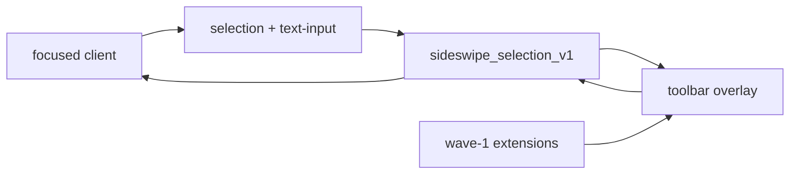

> RFC 005. Status: Draft. Target: sideswipe `master`, Zig 0.16.0. Depends on RFC 001 M3 (shell socket; `zwp_primary_selection_v1` / `zwp_text_input_v3` as they land) and RFC 002. Amends S6. Port source: `/home/jsalopek/dev/ventana/lollipop/src/Lollipop.Core` and `Lollipop.Extensions`.

## Requirements Summary

The text-selection toolbar is the secondary command surface. Owning the compositor is what makes a Linux port honest: selection geometry, text, and replace go over a privileged protocol instead of UIA + `SendInput`. Wave 1 is deterministic and ships without an LLM.

### Goals

- Amend S6 from copy/paste/search to an extension host.
- SDK apps get a rich selection API. Foreign clients degrade to primary selection + clipboard.
- Fail closed on password fields.

### Non-goals (follow-up RFCs, not this file)

- Wave 2: on-device LLM (writing tools, translate, define, developer tools, research).
- Wave 3: PDF via Poppler + Tesseract.
- Wave 4: Predict / IME (`zwp_input_method_v2` + ghost text). There is no TSF on Linux; this is a new IME, not a port.
- Global `WH_MOUSE_LL` / `WH_KEYBOARD_LL`. Gestures are compositor-owned.

## Requirements (L) — amends S6

- **L1** `sideswipe_selection_v1` on the private shell socket only: appeared / moved / cleared; caret or range rect; read text + mime types; replace/paste; `sensitive` flag.
- **L2** Placement ports `ToolbarPlacement` (smart / above / below, flip, clamp). Rect preference: text-input-v3 cursor, else selection bounds, else pointer at selection time, else focused tile center (S6 order kept).
- **L3** Show on compositor-observed selection (primary selection and/or L1). Keyboard settle delay default 300 ms, stored in `toolbar.toml`. Manual summon chord is a `[toolbar]` setting, not a general bind table.
- **L4** Sensitive-input (`SensitiveInputPolicy`): if `sensitive` is set or the field is a password role, do not show and do not read. Fail closed.
- **L5** Wave-1 extensions: clipboard copy/cut/paste + clean link; markdown wraps; search + Wikipedia; unit conversion; deterministic case transforms. Contextual budget + enable/order live in `toolbar.toml` (002).
- **L6** SDK apps implement L1 richly. Foreign clients: trigger from `zwp_primary_selection_v1`; replace may be clipboard + paste synthesis performed by the compositor, never by an unprivileged client injecting keys.
- **L7** Toolbar is a shell overlay role (`edit_menu` in 001, or a renamed `toolbar` role). Lifetimes still clamp (S8).
- **L8** Selection truncation cap (~10k chars) refuses destructive replace.

## Approach

Port `MouseGestureRecognizer`, `KeyboardSelectionRecognizer`, `ToolbarPlacement`, `SensitiveInputPolicy` into compositor or shared `src/core/` as pure functions. Extension host ports `IToolbarExtension` / composer ideas, implemented in Zig in the shell (or SDK once 003 exists).

001 S6 "v1: copy, paste, search; app actions deferred" is superseded by L5. The *protocol* remains selection + placement + replace; features live in the shell.

## Acceptance

- Select text in an SDK Notes spike (or `foot` degraded path): toolbar appears near the caret, Copy works, Esc dismisses.
- Markdown bold wraps the selection and replace writes back on an SDK client.
- Password field: no toolbar, no read, no log of contents.
- Foreign client without L1: toolbar still opens from primary selection; replace is best-effort and documented as degraded.
- Killing the shell does not crash the compositor; toolbar simply absent (fallback ring unchanged).

## File Checklist

| Order | File |
|---|---|
| 1 | `protocols/xml/sideswipe-selection-v1.xml` |
| 2 | `src/compositor/protocols/selection.zig` |
| 3 | `src/core/toolbar/placement.zig`, `gesture.zig`, `sensitive.zig` |
| 4 | `src/core/config/toolbar.zig` |
| 5 | `src/shell/` toolbar + wave-1 extensions |
| 6 | `src/sdk/` selection bindings (after 003) |

## Security Considerations

- L1 binds only on the private socket after P2 pid auth. Ordinary clients cannot read other apps' selections through it.
- Sensitive flag is fail-closed. Clipboard history (if added later) is local-only and privacy-gated; not in wave 1.
- Key injection for foreign-client replace, if any, is compositor-owned and skipped when `sensitive`.

## Open Questions

- Whether wave-1 replace on foreign clients is in or we ship show-only until enough SDK apps exist. Default: compositor paste synthesis, documented degraded.
- AT-SPI as an extra foreign-client hint. Optional; L1 + primary selection are the v1 paths.

## Notes

- 001 M5 still lands shade/HUD. This RFC can attach to the same `edit_menu` surface slot.
- Do not start Predict work in this tree until a later RFC exists.
