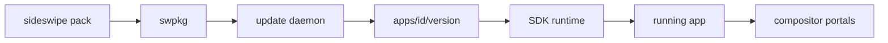

> RFC 006. Status: Draft. Target: sideswipe `master`, Zig 0.16.0. Depends on RFC 003 MVP. Unblocks 008 Store app and remote index. Does not install the OS.

## Requirements Summary

App updates and OS updates are different channels. First-party apps are signed `.swpkg` bundles against a versioned SDK runtime, not rebuilt against host libc soup. Phase A is a directory plus a daemon. A remote store index is Phase B (008).

### Goals

- Steal apk/ipk simplicity, AppImage relocatability, Flatpak portals (not the OCI stack), Play Store per-app deltas.
- `sideswipe pack` produces a bundle; `sideswipe install` / remove work offline.
- First-party apps never ship as Arch packages or Flatpaks.

### Non-goals

- Remote Store UI and CDN (008).
- Sandboxing every foreign GTK/Qt/Flatpak app. Those keep their own install paths during Phase A.
- Rebuilding the compositor to ship a Notes update.

## Requirements (G)

- **G1** Bundle layout: `manifest.toml` (id, version, SDK ABI, permissions, name/icon), relocatable binary, `resources/`, detached signature.
- **G2** Shared SDK runtime (semver ABI). Apps link the runtime; they do not vendor `src/sdk`. Mismatched ABI refuses to launch with a clear error.
- **G3** Install roots: user `$XDG_DATA_HOME/sideswipe/apps/<id>/<version>/` and system `/usr/lib/sideswipe/apps/`. One active version per id. Writes a `.desktop` that 004 can launch.
- **G4** Permissions in the manifest: at least `network`, `files.documents`, `clipboard`. Default is none. Enforcement is compositor portals, not trusting the app.
- **G5** Local daemon applies an update: verify signature, unpack next to the current version, flip the active symlink, keep one previous version for rollback.
- **G6** Optional zstd/bsdiff delta from the previous version. Full bundle must always work when no delta exists.
- **G7** `sideswipe pack` / `install` / `remove` / `rollback` on the 003 CLI.

## Approach

Lessons, not clones: apk/ipk directory discipline; AppImage + runtime instead of a 200 MB bundle; Flatpak permission *ideas*; Play Store deltas.

Foreign apps may still be distro packages in Phase A. First-party apps are only `.swpkg`.

## Acceptance

- Pack Settings (003 dogfood) to `.swpkg`, install to the user dir, launch from the ring (004) or `exec`.
- Install a second version; daemon keeps the previous; `rollback` restores it.
- An app without `network` cannot open a TCP socket via the portal (or the portal denies). Document the exact enforcement mechanism in the implementation notes.
- Unsigned bundle refuses to install.

## File Checklist

| Order | File |
|---|---|
| 1 | `src/pkg/manifest.zig`, `src/pkg/bundle.zig` |
| 2 | `src/pkg/runtime.zig` |
| 3 | `src/pkg/daemon.zig` |
| 4 | `src/pkg/portal.zig` (compositor side in `src/compositor/protocols/`) |
| 5 | CLI verbs on `src/tools/sideswipe-cli/` |
| 6 | `docs` snippet: signing keys for developers |

## Security Considerations

- Signatures required. Development builds may use a local trust-dev key, never "skip verify" in non-debug.
- Portals are deny-by-default. Clipboard portal for ordinary apps is not the privileged 005 selection protocol.
- Daemon talks over a 0600 socket. No network listener in Phase A.

## Open Questions

- Isolation: Landlock vs bubblewrap vs user namespace. Pick one in implementation; G4 is the contract.
- Signature scheme: minisign or signify-style. Avoid a custom crypto format.

## Notes

- 007 bootstrap may preinstall system `.swpkg`s (Settings, shell extras) into `/usr/lib/sideswipe/apps`.
- Remote index, ratings, and paid apps are 008-or-later.
