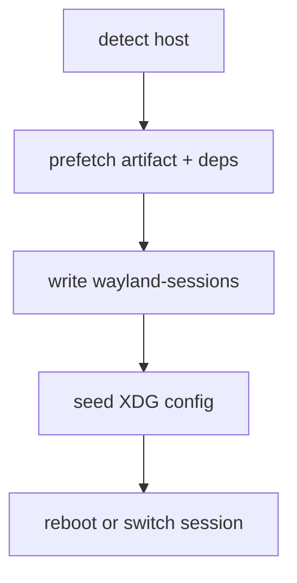

> RFC 007. Status: Draft. Target: sideswipe `master`, Zig 0.16.0. Depends on RFC 001 M3 prebuilt artifacts. Optional: 002 defaults, 006 system `.swpkg`s. Must not use the App SDK (no compositor yet). 008 is the ISO, not this file.

## Requirements Summary

The first-time path is a GUI that prefetches binaries and host libraries, then registers a Wayland session. End users never install Zig, run `modprobe` by hand, or edit a `.desktop` file. This is a desktop on-ramp, not a distribution yet.

### Goals

- Arch first; NixOS host second if cheap.
- Prefetch while showing progress.
- Optional Developer Tools package (Zig + SDK + CLI) is separate.

### Non-goals

- Disk partitioning, bootloader, user creation (008).
- Supporting "SDK apps on GNOME". After install, the session is Sideswipe.
- Building from source as the default path.

## Requirements (B)

- **B1** CI produces a tagged artifact: compositor, shell, protocols/runtime libs we do not expect from the host, `sideswipe.desktop` session file.
- **B2** Installer detects the host package manager. On Arch, install known system deps (`libdrm`, `libinput`, `libseat`, `libudev`, `pixman`, `gbm`, `egl`, `glesv2`, `wayland`, `xkbcommon`, `hwdata`) or skip if present.
- **B3** Prefetch the B1 artifact (or host packages that already provide the compositor, if we ever publish them). Progress UI is required; silent curl is not.
- **B4** Write a greeter session (`/usr/share/wayland-sessions/sideswipe.desktop` or equivalent for greetd/SDDM/GDM) that execs the compositor with `--physical-input` on a TTY seat.
- **B5** First-run: create 002 config dir with compiled defaults if missing. Do not require the user to write TOML.
- **B6** The installer is a standalone Zig binary with a tiny immediate-mode UI (or equivalent). It is not an SDK app and not a GTK app we would have to maintain as a second toolkit.
- **B7** Failure modes name the missing piece (seat, GPU node, greeter) and a single next step. No "install the Zig toolchain" in the happy path.
- **B8** Developer Tools is an optional checkbox: Zig 0.16+, SDK, `sideswipe` CLI.

## Approach

Chicken-and-egg: this UI runs on the user's current desktop or a TTY framebuffer. Keep the widget set small enough that we can throw it away when 008's live ISO installer exists.

Kernel modules: depend on the host distro's linux package. The installer may remind the user to reboot after a new kernel; it does not compile out-of-tree modules.

## Acceptance

- On a clean Arch box with a working greeter, a non-technical user finishes the GUI and can pick "Sideswipe" at next login.
- The machine has no Zig compiler unless Developer Tools was checked.
- Re-running the installer is idempotent (refresh artifact, keep user TOML).
- Nested-only machines (no DRM seat) get a documented "use your existing compositor" path that installs the binary and a `sideswipe-nested.desktop` instead of failing the DRM path silently.

## File Checklist

| Order | File |
|---|---|
| 1 | CI job publishing `sideswipe-desktop-<ver>-x86_64.tar.zst` |
| 2 | `src/tools/bootstrap/` installer binary |
| 3 | `data/sideswipe.desktop`, `data/sideswipe-nested.desktop` |
| 4 | Host dep lists: `data/deps/arch.txt` (NixOS later) |

## Security Considerations

- Artifacts are signed (same scheme as 006 if it exists; otherwise minisign). HTTPS download + signature verify before unpack.
- Installer asks polkit/sudo only for system paths (`/usr/lib/sideswipe`, wayland-sessions). User config stays in `$HOME`.

## Open Questions

- Whether we also publish an AUR/`pacman` package that the installer can prefer over the tarball on Arch.
- greetd vs SDDM vs GDM: write all three session files; do not ship a greeter in this RFC.

## Notes

- 001 M2/M3 must be daily-drivable in nested mode before promising a TTY session.
- This RFC is the answer to "bootstrapping sideswipe for the first time" on a machine that already has Linux.
