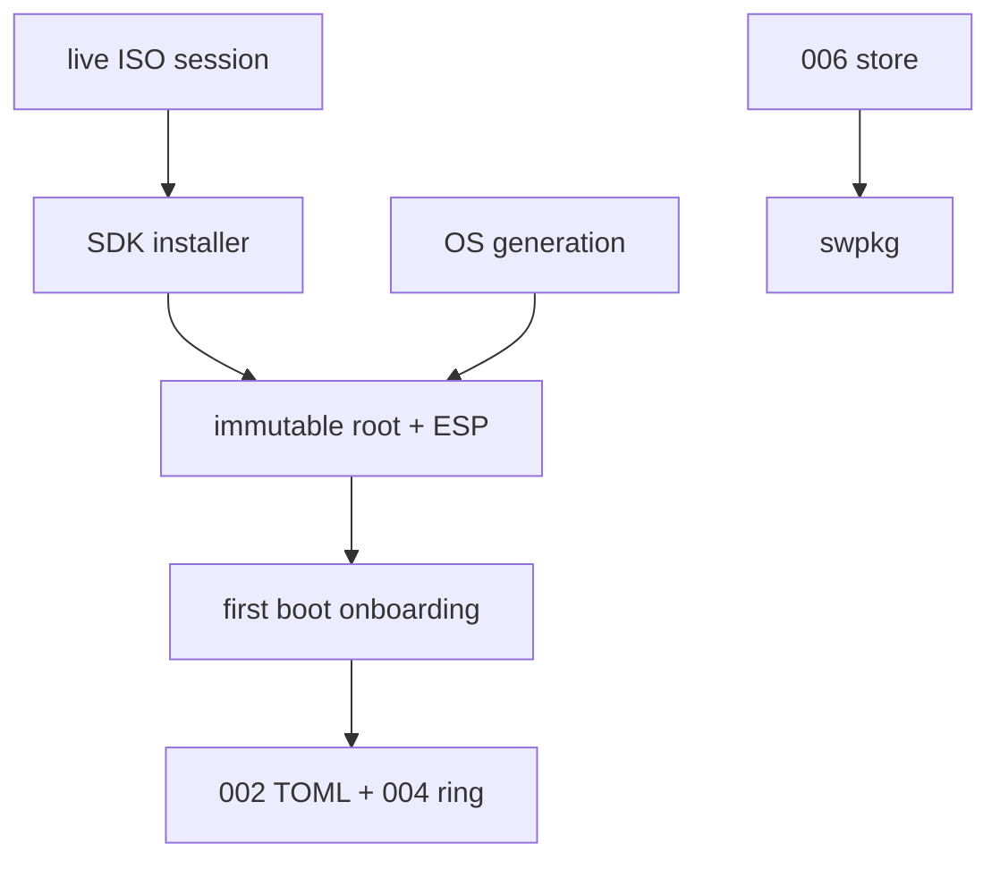

> RFC 008. Status: Draft. Target: sideswipe `master`, Zig 0.16.0. Depends on RFC 003, 006, and 007. Do not start until the desktop path works. Preferred bases: NixOS generations, or Arch + `systemd-sysupdate` + UKI A/B.

## Requirements Summary

Sideswipe becomes a UNIX appliance: Mac-like stability on the base, ricing on the session. Users do not write Nix, maintain a rolling Arch, install a Zig toolchain, or load kernel modules by hand. Rollback is a previous generation. Apps update via 006, not by rebuilding the OS.

### Goals

- Live ISO already runs the compositor + shell + Settings.
- Installer is an SDK app (disk, user, timezone, seed the Orbit ring).
- Hidden UNIX. TOML remains the user-facing config (002).

### Non-goals

- Replacing 007; the desktop bootstrap stays for people who already have Linux.
- Teaching users Nix or pacman as the ricing interface.
- Shipping Predict, LLM toolbar wave 2, or a general shell plugin system.

## Requirements (N)

- **N1** Immutable base image. Recommended: NixOS flake → generations. Alternative: Arch + `systemd-sysupdate` + UKI A/B if Nix stays build-only. Pick one before the first ISO tag.
- **N2** User-facing config is still `$XDG_CONFIG_HOME/sideswipe/` (002). The image may contain Nix/os-release internals; Settings never exposes them as the primary UI.
- **N3** Live ISO boots to Sideswipe on DRM. Installer app (003) partitions, creates a user, sets timezone/locale, seeds 004 defaults, copies the image.
- **N4** OS channel ≠ app channel. OS updates flip a generation; 006 daemon updates `.swpkg`s. Notes can update without a reboot. Kernel/compositor updates may require reboot and must be roll-backable.
- **N5** Remote store: signed index of `.swpkg`s, Store SDK app, same verify path as 006. Phase A local-only daemon keeps working offline.
- **N6** First boot: 004 "try it now" summon + 005 teaching tip. No terminal-as-setup.
- **N7** Advanced ricing: TOML + theme tokens. Optional documented escape hatch (Nix overlay or unlocked `/etc`) is not required for v1.

## Approach

Stability vs ricing: the base is appliance-stable (atomic, signed, rollback). The session is riceable (TOML, theme, ring, wallpaper). That is closer to macOS than to Arch without forbidding customization.

007's standalone installer remains the on-ramp for existing machines. This RFC is for people who want to wipe a disk and get an appliance.

## Acceptance

- Boot the ISO on a VM with virtio-gpu or a supported DRM device; reach a Sideswipe session without a TTY login dance.
- Install to a second virtual disk; reboot into the installed system; Settings and the ring work.
- Apply a dummy OS update and roll it back. Apply a dummy Notes `.swpkg` without an OS update.
- A user who never opens a terminal can complete install + first boot.

## File Checklist

| Order | File |
|---|---|
| 1 | `os/flake.nix` and/or `os/sysupdate/` (choice recorded in a short ADR) |
| 2 | `src/apps/installer/` (SDK app) |
| 3 | `src/apps/store/` |
| 4 | `os/iso/` live image plumbing |
| 5 | Signing + update endpoint docs |

## Security Considerations

- Image and store index are signed. Secure Boot/UKI is a hard goal of the Arch-sysupdate path and a should of the NixOS path.
- Installer is the most privileged SDK app we will ever ship; it runs only from the live image and is not in the installed app index.
- Store installs use 006 verify + portals. No "curl | sh" channel.

## Open Questions

- NixOS vs Arch+sysupdate as the first tagged ISO. Default recommendation: NixOS generations for rollback UX; keep Arch as the 007 host.
- Encryption (LUKS) in the v1 installer. Default: offer it, do not require it.

## Notes

- 001 M6 session lock should exist before this is a daily driver on real hardware.
- If 003/006 slip, keep shipping 007. This RFC is last on purpose.
